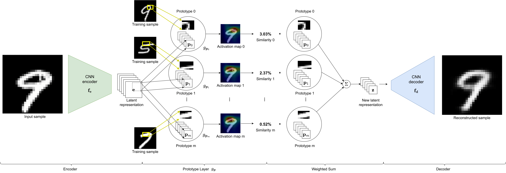

# Label-Free XAI


Code Author: Claudio Fanconi ([fanconic@gmail.com](mailto:fanconic@gmail.com)) based on Jonathan Crabbé's original repository

This repository contains the implementation of the Prototype Autoencoder.

## 1. Installation
From PyPI
```bash
pip install lfxai
```

From repository:
1. Clone the repository
2. Create a new virtual environment with Python 3.8
3. Run the following command from the repository folder:

```shell
pip install .
```

When the packages are installed, you are ready to explain unsupervised models.


## 2. Reproducing the paper results

### MNIST experiments
In the `experiments` folder, run the following script
```shell
python -m proto_mnist --name experiment_name
```
where experiment_name can take the following values:

| experiment_name      | description                                                                  |
|----------------------|------------------------------------------------------------------------------|
| predictive_performance_and_ablation | Training and saving the models<br/> over 5 runs (paper Section 3.1 and 3.4) |
| proto_consistency_feature_importance | Consistency check for label-free<br/> feature importance (paper Section 3.2) |
| proto_consistency_examples | Consistency check for label-free<br/> example importance (paper Section 3.2) |
| proto_pretext_task_sensitivity              | Pretext task sensitivity<br/> use case (paper Section 3.3)                   |

The resulting plots and data are saved [here](results/mnist).


### Fahsion MNIST experiments
In the `experiments` folder, run the following script
```shell
python -m proto_fashion_mnist --name experiment_name
```
where experiment_name can take the following values:

| experiment_name      | description                                                                  |
|----------------------|------------------------------------------------------------------------------|
| predictive_performance_and_ablation | Training and saving the models<br/> over 5 runs (paper Section 3.1 and 3.4) |


The resulting plots and data are saved [here](results/fashion_mnist).